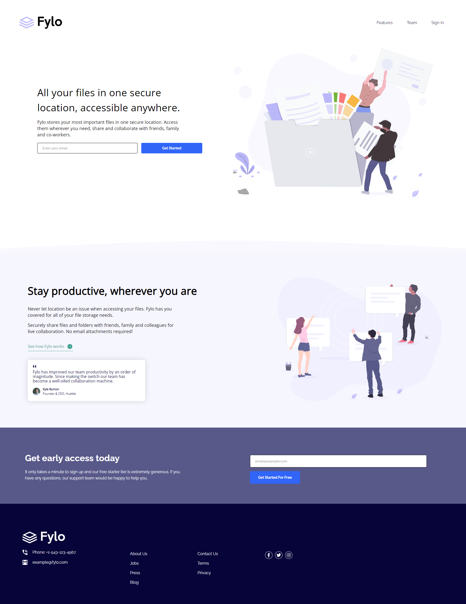
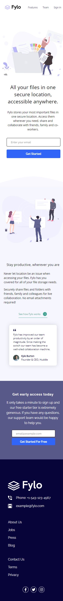

# Frontend Mentor - Fylo landing page with two column layout solution

This is a solution to the [Fylo landing page with two column layout challenge on Frontend Mentor](https://www.frontendmentor.io/challenges/fylo-landing-page-with-two-column-layout-5ca5ef041e82137ec91a50f5).

## Table of contents

- [Overview](#overview)
  - [The challenge](#the-challenge)
  - [Screenshot](#screenshot)
  - [Links](#links)
- [My process](#my-process)
  - [Built with](#built-with)
  - [What I learned](#what-i-learned)
- [Author](#author)

## Overview

### The challenge

Users should be able to:

- [x] View the optimal layout for the site depending on their device's screen size
- [x] See hover states for all interactive elements on the page

### Screenshot

<p align="center">
    
</p>

<p align="center">
    
</p>

### Links

[Live](https://fylo-landing-page-sigma-ten.vercel.app)

## My process

### Built with

- Typescript
- Mobile-first workflow
- [React](https://reactjs.org/) - JS library
- [Styled Components](https://styled-components.com/) - For styles

### What I learned

In this project I was given a svg file that had a purpleish colored element, and a black text for the logo. However, at the footer of the website, I needed that svg file completely white. With this, I learned about the css `filter`

My first approach was to try to invert the colors. That did make the text white, instead of black, but the purpleish colored element became something else. That's how I decided to add two filters to make them the same color, before inverting.

```css
& > img {
  filter: brightness(0%) invert(100%);
}
```

This code targets the svg file, and adds 2 filters:

- `brightness(0%)`: Removes the brightness, making the svg completly black.
- `invert(100%)`: Inverts the currently black svg, to the opposite color, white.

Now the logo, that had 2 different colors, is all white.

## Author

- Frontend Mentor - [@yan-batista-1326](https://www.frontendmentor.io/profile/yan-batista-1326)
- LinkedIn - [@YanBatista](https://www.linkedin.com/in/yanbatista/)
